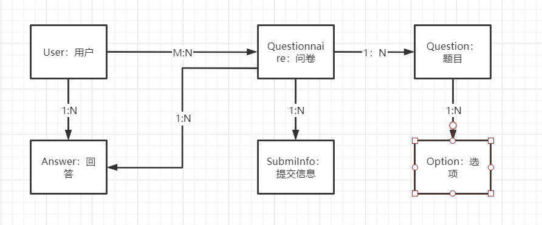
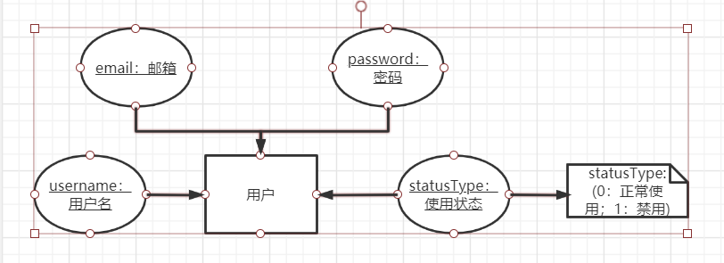
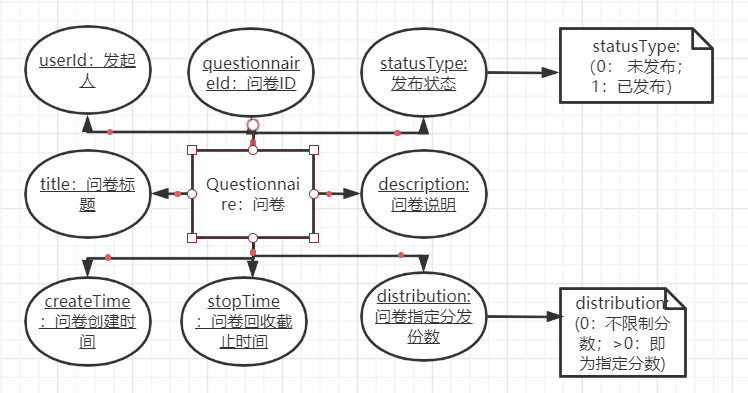
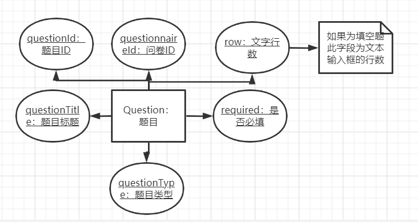
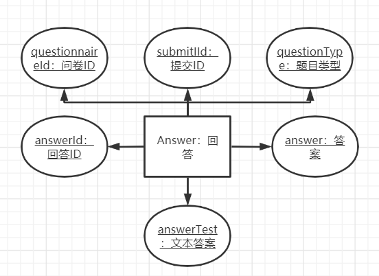
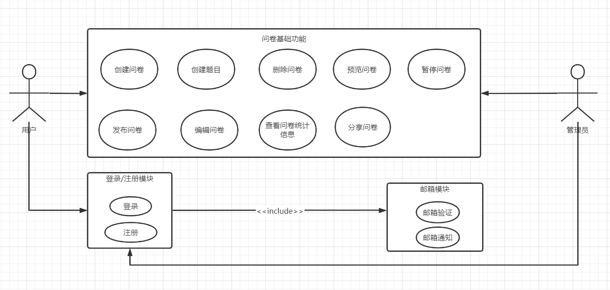

# 后端模块

## 技术图谱

使用框架：SpringBoot<version: >  Mybatis<version: >

数据库：MySQL<version: 5.7>

应用服务器：Tomcat<version: 9.0.41>

## 基础功能E-R图



### 用户



### 问卷



### 题目



### 选项


### 提交信息


### 回答



## 基础功能用例图



### 基础功能接口设计

### 用户接口类

```java
 /**
 * @description 用户接口类
 */
public interface UserServiceInterface {

    /**
    * @description 登录
    */
     Result signin(String email, String password);

    /**
    * @description 登出
    */
    Result signout();

    /**
    * @description 注册
    */
    Result signup(String email, String password, String verify);
    
    /**
    * @description 修改用户信息
    */
    Result updateUser(User user);
    
    /**
    * @description 删除用户
    */
    Result deleteUser(Integer userId);
}
```

### 问卷接口类

```java
 /**
    * @description 问卷接口类
    */
public interface QuestionnaireServiceInterface {
    
    /**
    * @description 根据问卷ID查询问卷
    */
    Result findQuestionnairesById(Integer questionnaireId);
    
    /**
    * @description 查询该用户创建的所有问卷
    */
    Result findQuestionnairesByUser(Integer userId);

    /**
    * @description 创建问卷
    */
    Result createQuestionnaire(Questionnaire questionnaire);

    /**
    * @description 修改问卷
    */
    Result updateQuestionnaire(Questionnaire questionnaire);
    
    /**
    * @description 删除问卷: 需先级联删除问卷包含的选项和问答
    */
    Result deleteQuestionnaire(Questionnaire questionnaire);
    
    /**
    * @description 查询该用户创建的所有问卷
    */
    Result findQuestionnairesByUser(Integer userId);   
    
}
```

### 回答接口类

```java
/**
* @description 回答接口类
*/
public interface AnswerServiceInterface {
    
    /**
	* @description 根据问卷ID查询所有回答
	*/
    Result findAswersByQuestionnaireId(Integer questionnaireId);
    
    /**
	* @description 根据题目ID查询所有回答
	*/
    Result findAswersByQuestionId(Integer questionId);
    
}
```

### 邮箱接口类

```java
/**
* @description 邮箱接口类
*/
public interfacve EmailServiceInterface {
    
    /**
    * @description 发送邮件验证码
    */
    Result sendVerifyCode(String email, String verifyCode);
    
    /**
    * @description 发送问卷填写邮件通知
    */
    Result sendQuestionnaire(String email, Integer questionnaireid);
}
```

## Future

### 内容分析模块

### 偏好问卷推荐模块