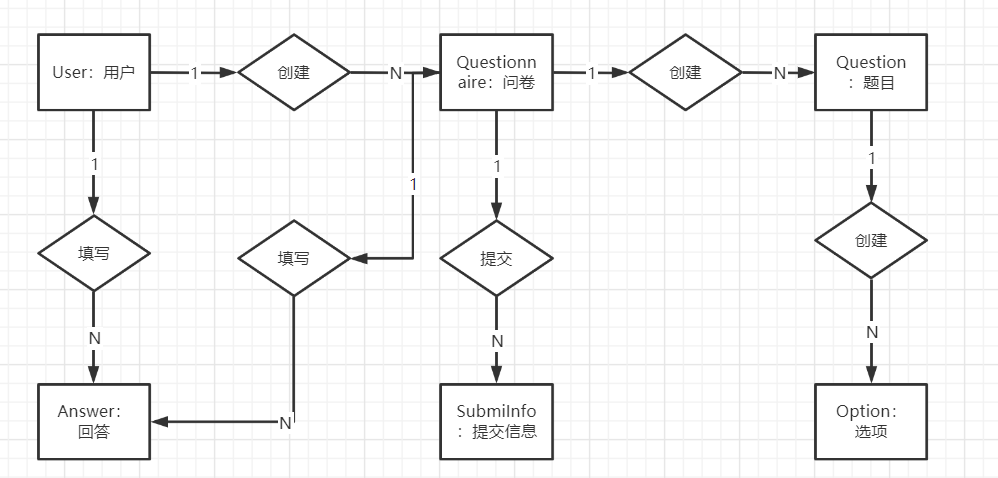
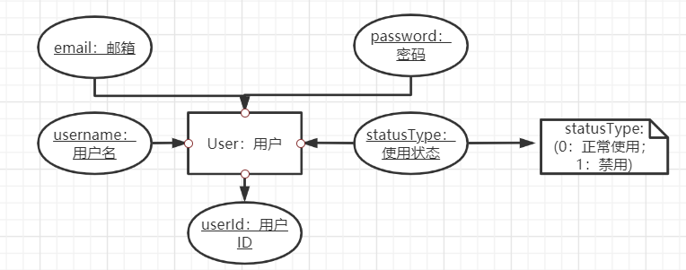
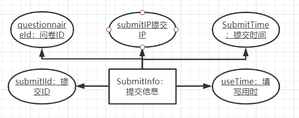

# 后端模块

## 基础功能E-R图



### 用户




### 问卷


### 题目


### 选项


###  提交信息



### 回答


## 

### 基础功能模块

```java
/**
* @description
*/
public interface login(String email, String password);
```


### 邮件通知模块

###  内容分析模块

### 问卷推荐分发模块