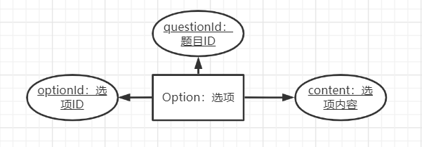
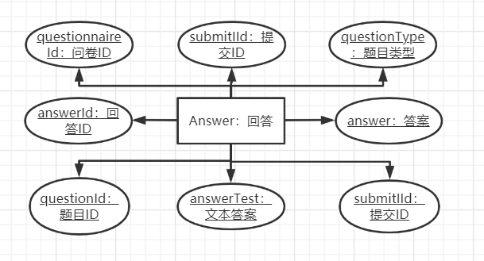

# 后端模块

## 技术图谱

语言：JAVA1.8

使用框架：SpringBoot<version: 2.4.2>  MybatisPlus<version: >

数据库：MySQL<version: 5.7>

应用服务器：Tomcat<version: 9.0.41>

## 基础功能E-R图


### 用户


### 问卷


### 题目


### 选项



### 提交信息


### 回答



## 基础功能用例图


### 基础功能接口设计


### 邮箱接口类

```java
/**
* @description 邮箱接口类
*/
public interfacve EmailServiceInterface {
    
    /**
    * @description 发送邮件验证码
    */
    Result sendVerifyCode(String email, String verifyCode);
    
    /**
    * @description 发送问卷填写邮件通知
    */
    Result sendQuestionnaire(String email, Integer questionnaireid);
}
```

## Future

### 内容分析模块

### 偏好问卷推荐模块